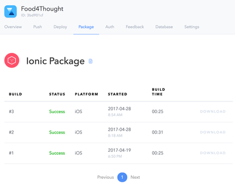
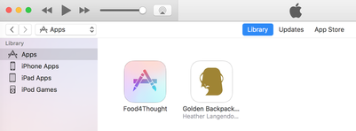
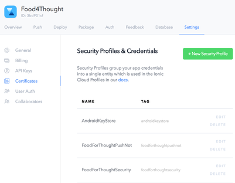
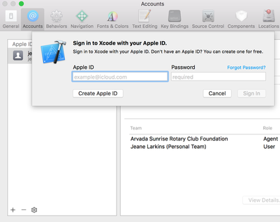
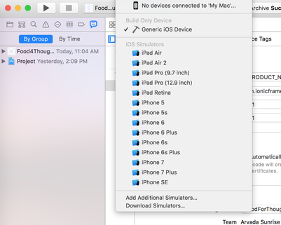
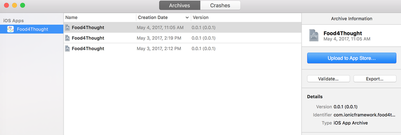

# FoodForThought App Continuation Guide

This is a development guide for the FoodForThought volunteer organization app. It will walk you through basic setup of the development environment, basic knowledge about the frameworks and tools we used, and the solved/unsolved problems we've run into.

## Getting Started

### Prerequisites

You'll need to install node.js and ionic to get started with our app. Node.js can be downloaded for your operating system [here.][beae58db]

  [beae58db]: https://nodejs.org/en/ "Node.js"

  Ionic can then be installed by running the following in your terminal:

```
npm install -g cordova ionic
```

**Note: This app was created using ionic v1. While you don't have to do anything during install to specify that you're using v1, you will need to make sure you reference the v1 docs, and not v2.**

In order to build the app for Android and iOS, you will need to follow the [Android][33764a3e] and [iOS][90d500ab] platform guides respectively.

  [33764a3e]: https://cordova.apache.org/docs/en/6.x/guide/platforms/android/ "Android Platform Guide"
  [90d500ab]: https://cordova.apache.org/docs/en/6.x/guide/platforms/ios/ "iOS Platform Guide"

### Installing

Clone the FoodForThought app git repository.

[//]: # (Need to change the github url for when we give it to Danielle)

```
git clone https://github.com/DJW0519/SrProjectFoodForThought
```

Run the app in your web browser to verify that it works. Make sure you are in the "FoodForThought" folder.
```
cd SrProjectFoodForThought/FoodForThought
ionic serve
```

You should see the following screen on startup.

[//]: # (Insert picture of welcome screen here)

To build and emulate for iOS, run

```
ionic build ios
ionic emulate ios
```

To build and emulate for Android, run

```
ionic build android
ionic emulate android
```

Make sure you've followed the guides for each platform before attempting to build and emulate!

## Front End Information

### Ionic file structure

The different screens of the app are each their own html file located in the templates folder.
```
SrProjectFoodForThought/FoodForThought/www/templates
```
Each screen also has a controller associated with it, which controls how it behaves. All the controllers are defined in controllers.js

```
SrProjectFoodForThought/FoodForThought/www/js/controllers.js
```

These two are linked in the stateprovider, which is located in app.js

```
SrProjectFoodForThought/FoodForThought/www/js/app.js
```
When making a new screen, you'll want to create an html template for it, add a controller for it in controllers.js, and then define both of them in app.js

Since back-end functionality for the Admin tabs was not completed, the functions and local storage takes place in services.js.
```
SrProjectFoodForThought/FoodForThought/www/js/services.js
```

### Ionic Plugins

We installed a few plugins on top of ionic. There is no need to reinstall them, but it may be helpful to reference their docs.

#### Ionic Filter Bar

This is used in the admin checkin screen to search for volunteers from a list. You can find the docs [here.][e1daa1ff]

  [e1daa1ff]: https://github.com/djett41/ionic-filter-bar "Ionic Filter Bar Github"

#### ngStorage

This plugin is used to handle local storage. Specifically, we used it to store user credentials and which user is currently logged in. You can find the docs [here.][fdfb298b]

  [fdfb298b]: https://github.com/gsklee/ngStorage "ngStorage Github"

Users can be found in $scope.$storage.users. The email of the current user is found at $scope.$storage.currentUser. You can access a particular user by using their email as the key. So, the currently logged in user's info can be accessed through the following:

```
$scope.$storage.users[$scope.$storage.currentUser]
```

### Partially Completed Features

#### Geolocation

We've started working on checking people when they arrive at a volunteer location. We've implemented a basic example that returns your current lattitude and longitude using the Cordova Geolocation Plugin. You can play with it in the 'Geolocation' git branch.

```
git checkout Geolocation
```

You then need to manually navigate to the geolocation test page in your browser.
```
localhost:8100/#/geo
```
You can then press "F12" to open the developer console (on chrome), and you should see your current latitude.

The controller for the geolocation test page is named 'GeoCtrl'

This feature needs to wait until the time of a volunteer's shift, then start checking if they are within a certain radius of a volunteer location (which would be set by an admin under 'manage locations'.)
If the volunteer entered that radius within a short time after the shift started, they would be checked in for that shift.

#### Settings Screen

##### Logout

The settings screen currently has a "Logout" button. This needs to set $scope.$storage.currentUser to null and redirect to he welcome screen.

##### Automatic Check In

Once geolocation is implemented, this toggle switch needs to be combined with "location services" and should prompt the user to enable gps for the app, and enable automatic check in.

## Features Needing Back End Support
There are some features that are entirely implemented on the front end, but need implementation on the back end in order to function. These are mostly admin features.

### Creating Notifications

Notifications can be created in the admin section of the app, but they are only stored locally; they are not distributed to volunteers. For this to function, there needs to be a place in Salesforce to store the notifications, and a way to retrieve the notifications from Salesforce on the app.

### Creating Locations/Shifts

New locations and volunteer times can be created in the admin section of the app, but doing so does not create new shifts in Salesforce. Locations are okay to be stored locally, (though it isn't necessarily ideal) but volunteer times need to be stored in Salesforce, and retrieved to populate the shifts on the home screen.

### Checking in Volunteers as Admin

Given a list of volunteers, an admin can move them from a "Unchecked" list to a "Checked in" list locally in the app. This feature needs to be able to pull a list of volunteers for a given shift from Salesforce, and needs to be able to check in each volunteer through Salesforce.

## App Deployment Information

### Ionic Framework
The Ionic App ID is 3bd901cf. This ID is used in the ionic.config.json file to connect the code to the app on the Ionic site.

#### Ionic Website Tools
When logged into the Ionic website, you can access the code that you have built using the command line.

When an app is built, it shows up in the Package tab of the ionic site. This is where you can download the .ipa file which shows up in the Library portion of Apps on iTunes.



This can be loaded onto a phone connected to the computer.



The certificates for the App are in the Settings tab under Certificates. They were obtained from iTunes Connect and Android.



#### Ionic Command Line
##### Building
iOS:
```
$ ionic package build ios --profile foodforthoughtsecurity
```
Android:
```
$ ionic package build android --profile androidkeystore
```

#### Release
iOS:
```
$ ionic package build ios --profile foodforthoughtsecurity --release
```
Android:
```
$ ionic package build android --profile androidkeystore --release
```

#### Build Information
Check the status of the different builds by listing them.
```
$ ionic package list
```

#### Build Output
If a build fails, you can find out why by viewing the output.
BUILD_ID The build's ID found with ionic package list.
```
$ ionic package info BUILD_ID
```

#### Download
You can download successful builds. This will put the .ipa or .apk file in your app's directory.
BUILD_ID The build's ID found with ionic package list
```
$ ionic package download BUILD_ID
```

### iTunes Connect
Most of the information needed for application to the app store in iTunes Connect is self-explanatory. These are parts I had to research and go over multiple times.

#### Adding Screenshots
##### Configuring Xcode
After opening Xcode, go to Xcode->Preferences.
Here you will click on the Accounts tab. Then click the + symbol at the bottom of the pop up and select Add Apple ID...
Email: jelarkins@foodforthoughtdenver.org
Password: CU2017srproject



##### Load App into Xcode
Go to File->Open and select the Xcode project which can be found at SrProjectFoodForThought/Food4Thought/platforms/ios/Food4Thought.xcodeproj

##### Take Screenshots
Screenshots are needed to display in the App Store so people can see what app they are getting.
Select which device to use in the upper left corner of the Xcode screen. You will use the iPhone 6 Plus for the 5.5 inch display pictures and the iPad Pro 12.9 inch for the 12.9 inch pictures.



After selecting which device you want to use, select Product->Run. This will run the app on an emulated device. On this device you will navigate to the views you want to submit as screenshots. Select File->Save Screen Shot, which will save the screenshots to the Desktop.
These can then be uploaded into iTunes Connect.

#### Adding a Build
In order to submit an app to the App Store, you need to give iTunes a build.

##### Building the App
Make sure that in the upper left corner, the device chosen is Generic iOS Device.


Go to Product->Build to build the project.

##### Archive
Once the project is built with no errors, go to Product->Archive. This will package the app together so you can submit it to iTunes Connect. This window pops up when the archive is finished, but can also be accessed through Window->Organizer.
Choose Export to save the packaged build to your computer.



##### Put Build in iTunes Connect
In the Build section of preparing the app for submission, click the + symbol and select the file you exported from Xcode.

## Back End Information

The Food For Thought app back end is Salesforce, specifically Volunteers for Salesforce. Volunteers for Salesforce is a package that is install on your Salesforce instance. Once installed Volunteers for Salesforce can manage the volunteers, jobs, shifts, and hours. Volunteer for Salesforce can also track and create reports on all the data that is generated from volunteer’s events and shifts. So the majority of the back end is utilizing the Volunteers for Salesforce package and having the Food For Thought app interface with it.

This is where we ran into our biggest problem that we unfortunately were not able to implement a viable working solution. We were not able to get our Food for Thought app to interface with the Volunteers for Salesforce package at all. We ran into a lot of problems, but we also learned a few things that hopefully can provide you with the knowledge to solve these problems going forward.

This portion of the guide will cover what we learned and what problems we encountered on the back end.

### Existing Salesforce Account
To log into the Salesforce Sandbox, click https://cs43.lightning.force.com/one/one.app. The Salesforce Food For Thought administrator should be able to create additional logins to the company sandbox, as to not neccesarily require the existing account credentials from former developers.

### API and Salesforce Objects

We choose to use REST api to interface with Salesforce since it is friendly for mobile and web application. Also because we are just sending messages from client to server and sending back a response. The REST api call is interacting with Salesforce Objects to add and modify data to your Salesforce instance. Some of the standard Saleforce objects are:


```
Account, Campaign, Contact, etc.
```

The full list of standard Salesforce Objects can be found here:

```
https://developer.salesforce.com/docs/atlas.en-us.object_reference.meta/object_reference/sforce_api_objects_list.htm
```
The Volunteer for Salesforce package uses custom objects. Volunteers for Salesforce custom objects are:

- Job Recurrence Schedule
- Volunteer Hours
- Volunteer Job
- Volunteer Recurrence Schedule
- Volunteer Shift

To find this list and more information on the custom objects of Volunteer for Salesforce:

- Login into Salesforce and click setup on the upper right hand corner of the screen
- Navigate to Create on the left hand side of the screen and click on the play button next to create
- On the drop down menu of select Objects
- Once Objects is selected it will show you all the custom objects of Volunteer for Salesforce
- Click on each label to find more information about each custom objects

### Issues with API Calls and Salesforce

We were using a Salesforce Starter Application code that was created by Salesforce and Ionic to test our back end and we discovered a few issues that we were never able to resolve. The first one we discovered is that when you are logged into a Salesforce account, you can only access that Salesforce instance of information. We originally thought that by creating a consumer key on a Salesforce instance and implementing that key in our code base it will allow us to grant any user the ability to access our Salesforce account data or any other Salesforce account data if the right consumer key was used, that was not the case. Salesforce is set up as to facilitate API calls through their controllers that are handled on the Salesforce site and tied to the master account for the organization. We are facilitating Volunteers for Salesforce as an intermediary between the application and the Salesforce database. This means that the public who has our application can sign up for shifts, but cannot directlya access the database, bypassing any security concerns. 

### Installing Volunteers for Salesforce Package For Salesforce

-	Salesforce Classic and Lighting Experience can be switched by clicking on the username and selecting the appropriate option. All instructions are written for Salesforce Classic.
-	Once logged into Salesforce.com, click on the blue “Site.com” button.
-	Select "AppExchange" from the popup menu of “Site.com”.
-	On the Apps search bar enter “Volunteer for Salesforce”.
-	Find and select the Volunteers for Salesforce app.
-	Click the green "Get It Now" button.
-	Select "Log in to the AppExchange Use your Salesforce credentials".
-	Volunteers for Salesforce can be either be install in production or Sandbox environment. Select "Install in production" option.
-	Click on the 'I have read and agree to the terms and conditions" and click the blue "Confirm and Install!" button.
-	Select "Install for All Users" and select on the blue "install" button.

### Configuring Volunteers for Salesforce

-	Once Volunteers for Salesforce is installed, return to your Salesforce homepage and click on setup tab which is next to your username.
-	On the left hand side of the screen under the "Build" option, click on the "Create" drop down button.
-	In the drop down menu of Create select and click Apps.
-	Click on edit of the Volunteer App Label.
-	Modify the Selected Tabs list to include:

&nbsp;&nbsp;&nbsp;&nbsp;&nbsp;&nbsp; Home <br>
&nbsp;&nbsp;&nbsp;&nbsp;&nbsp;&nbsp; Volunteers Help Volunteers Wizard <br>
&nbsp;&nbsp;&nbsp;&nbsp;&nbsp;&nbsp; Volunteer Jobs <br>
&nbsp;&nbsp;&nbsp;&nbsp;&nbsp;&nbsp; Shift Calendar <br>
&nbsp;&nbsp;&nbsp;&nbsp;&nbsp;&nbsp; Find Volunteers <br>
&nbsp;&nbsp;&nbsp;&nbsp;&nbsp;&nbsp; Leads <br>
&nbsp;&nbsp;&nbsp;&nbsp;&nbsp;&nbsp; Contacts <br>
&nbsp;&nbsp;&nbsp;&nbsp;&nbsp;&nbsp; Campaigns <br>
&nbsp;&nbsp;&nbsp;&nbsp;&nbsp;&nbsp; Reports <br>
&nbsp;&nbsp;&nbsp;&nbsp;&nbsp;&nbsp; Dashboards

-	Click save when completed.
-	Click on the plus button next to Home and Chatter on the top bar of Salesforce.
-	Click on the Orange “Customize My tabs” button.
-	Modify the Selected Tab list to include:

&nbsp;&nbsp;&nbsp;&nbsp;&nbsp;&nbsp; Home <br>
&nbsp;&nbsp;&nbsp;&nbsp;&nbsp;&nbsp; Volunteers Help Volunteers Wizard <br>
&nbsp;&nbsp;&nbsp;&nbsp;&nbsp;&nbsp; Volunteer Jobs <br>
&nbsp;&nbsp;&nbsp;&nbsp;&nbsp;&nbsp; Shift Calendar <br>
&nbsp;&nbsp;&nbsp;&nbsp;&nbsp;&nbsp; Find Volunteers <br>
&nbsp;&nbsp;&nbsp;&nbsp;&nbsp;&nbsp; Leads <br>
&nbsp;&nbsp;&nbsp;&nbsp;&nbsp;&nbsp; Contacts <br>
&nbsp;&nbsp;&nbsp;&nbsp;&nbsp;&nbsp; Campaigns <br>
&nbsp;&nbsp;&nbsp;&nbsp;&nbsp;&nbsp; Reports <br>
&nbsp;&nbsp;&nbsp;&nbsp;&nbsp;&nbsp; Dashboards

-	These tabs can be added selecting the appropriate name and clicking the add button.
-	Click save when complete.
-	These tabs should now be on the top bar of Salesforce.

### Mass Emailing Volunteers with Volunteers for Salesforce

**1.	Under the Volunteer Jobs tab**
-	Click the Volunteer Jobs tab.
-	Select all jobs or specific jobs in the View: field and click on the Go! Button.
-	Select the hyperlink under Volunteer Job Name or hyperlink under the Select the Campaign (Choosing the hyperlink under the Campaign will select all users that are associated with the campaign).
-	Depending on the selection of the previous action the next screen will be the job detail page or the Campaign detail page.
-	Click on the Mass Email Volunteers tab.
-	Complete the requested fields:

&nbsp;&nbsp;&nbsp;&nbsp; **From** – selecting who the email is from. <br>
&nbsp;&nbsp;&nbsp;&nbsp; **Email volunteers with Status** - status filter field. <br>
&nbsp;&nbsp;&nbsp;&nbsp; **Include Contacts only once** – selecting this will send one email to each unique contact, leaving this field unchecked will <br> &nbsp;&nbsp;&nbsp;&nbsp; email each contact for very hours on a job or shift. <br>
&nbsp;&nbsp;&nbsp;&nbsp; **Log an Activity for each email** – selecting this will log the activity on the contact’s record. <br>
&nbsp;&nbsp;&nbsp;&nbsp; **Template Based on Object** – select the object field that will be populated on selected email template (Object and Email <br> &nbsp;&nbsp;&nbsp;&nbsp; template should match each other). <br>
&nbsp;&nbsp;&nbsp;&nbsp; **Email Template** – select created email template.

-	Once selection has been made click on the blue send button on the upper right corner.

**2.	Under the Shift Calendar tab**
-	Click the Shift Calendar tab.
-	Select the Job shift on the Calendar.
-	Click on the Mass Email Volunteers tab.
-	Complete the requested fields:

&nbsp;&nbsp;&nbsp;&nbsp; **From** – selecting who the email is from. <br>
&nbsp;&nbsp;&nbsp;&nbsp; **Email volunteers with Status** - status filter field. <br>
&nbsp;&nbsp;&nbsp;&nbsp; **Include Contacts only once** – selecting this will send one email to each unique contact, leaving this field unchecked will <br> &nbsp;&nbsp;&nbsp;&nbsp; email each contact for very hours on a job or shift. <br>
&nbsp;&nbsp;&nbsp;&nbsp; **Log an Activity for each email** – selecting this will log the activity on the contact’s record. <br>
&nbsp;&nbsp;&nbsp;&nbsp; **Template Based on Object** – select the object field that will be populated on selected email template (Object and Email <br> &nbsp;&nbsp;&nbsp;&nbsp; template should match each other).
&nbsp;&nbsp;&nbsp;&nbsp; **Email Template** – select created email template.

-	Once selection has been made click on the blue send button on the upper right corner.

### Creating Email Templates

-	Select on the username in the upper right corner
-	Select My Setting on the pop-up window
-	Select the Email tab on the left side
-	Under the drop down option of the email tab select email templates
-	Select “New Template” button to create a new template or select the premade Salesforce template. The premade Salesforce template can be edited by clicking on the edit button.


### Classes and VisualForce Pages

-	To access click on "Set-Up" in the upper right corner of the screen.
-	Use the quick find search bar on the left side of the screen. 
-	Type in pages to find visualforce pages and classes to find apex classes.
-	In order to make any changes to either of these sections you must make your own copy of that file.
-	VisualForce pages are the visual aspect of the website while the APEX classes are the controller classes used to implement functionality

####APEX Classes
-	To Copy an APEX class you must go the the original github repo for Volunteers for Salesforce. ["HERE"](https://github.com/SalesforceFoundation/Volunteers-for-Salesforce)
-	Create a new APEX class by clicking the 'new' button in the middle of the APEX classes screen.
-	Paste the code into the screen.
-	There will likely be many errors that will prevent you from actually saving the file as your own class.
-	These issues will be primarily incorrectly named variables. Most commonly the issue will reside in the fact that almost every variable needs some form of "GW_Volunteers__" or "GW_Volunteers." appended to the beginning. 
-	Additionally you will encounter "invisible methods" called by your class that are implemented in another class that you will not have access to. You will want to track down the methods from their respective class in the github repo and include them in your new class as well. 
-	Several Pages have already been provided in the Salesforce Pages & Classes of our project so this may not be much of an issue. 
-	The name of the class is actually declared near the top of the document unlike a VisualForce page which as a box to declare the name of the page.
	eg. global virtual with sharing class myVOL_CTRL_VolunteersJobListingFS {} would make a class page named VOL_CTRL_VolunteersJobListingFS .

####VisualForce Pages
-	To copy a VisualForce page you will click the edit link next to that page. Copy the contents and paste them into a new VisualForce page.
-	You may occasionaly run into variable problems here but typically it will just be label permissions. 
-	Just find your way back to the quickfind search bar and type in labels then select "Custom Labels".
-	Find the corresponding label name and paste the contents into the variable section of your VisualForce page. 
-	Alternatively you could create your own custom label with the same data but a new name and just reference that in your page instead.
-	When a page is successfully created you must also add it to your active salesforce websites before it can be used. This can be done from the sites page.


### Activate Sites 
-	Go to Setup the setup page then under the Develop tab on the left hand side of the screen select "Sites".
-	Specify the name you want to use for your domain.  
-	#####Note that once set, you cannot modify this name, so make sure you use an appropriate name for your company.#####
-	The pages that Volunteers for Salesforce provides you will be hosted within pages owned by your website, so the actual Sites domain name will not be visible to users.  But you may have future needs that would expose Sites pages directly to the user, so you should still choose an appropriate name.
-	Click on “Check Availability” to make sure the name you gave is not already taken.
-	Read and check the “Sites Terms of Use"
-	Click “Register My Force.com Domain


####Troubleshooting
-	I never found a great way to go about this unfortunately. Typically, if you try to access a page with a non-functioning class or page you will get a confusing security error that you suddenly do not have permission to access this page. This is so that the innerworkings of your site are not accidentally exposed which is nice but frustrating without a doubt. 
-	My solution was to create a class and page called ErrorFinder and use them to call the broken page.
-	To do this go into the error finder apex class and look for the section that says Page.NAME_OF_PAGE.getContent().toString() 
-	Put the name of the page you want to troubleshoot into the NAME_OF_PAGE section and preview the ErrorFinder VisualForce page.
-	This should at least give you an error message to go on instead of pure guess work. (this isn't 100% effective but can be a handy tool) 


## Building the Docs

The developer guide (this document) and the user guide are both written in markdown, and then rendered to a styled html document using pandoc.

Follow the instructions [here][628df441] for installing pandoc for your operating system.

  [628df441]: http://pandoc.org/installing.html "Pandoc Installation Guide"

Once you have pandoc installed, navigate to the documentation folder.

```
SrProjectFoodForThought/docs
```

Then, convert the markdown files to html.

```
pandoc devGuide.md --template toc-sidebar.html --toc -B nav -o devGuide.html
pandoc UserGuide.md --template toc-sidebar.html --toc -B nav -o UserGuide.html
```

Make sure the "js", "css", and "images" folders are all in the same directory as the html documents.
